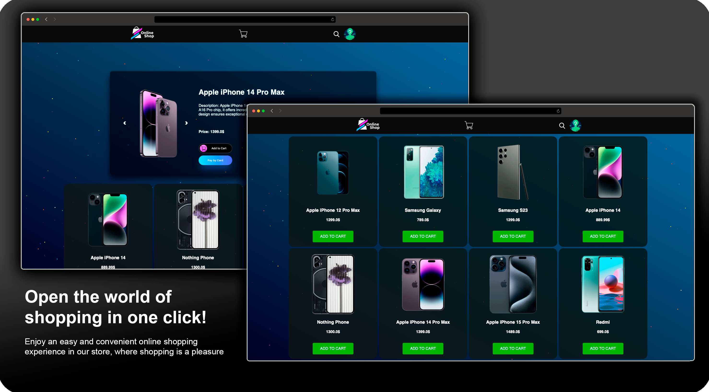
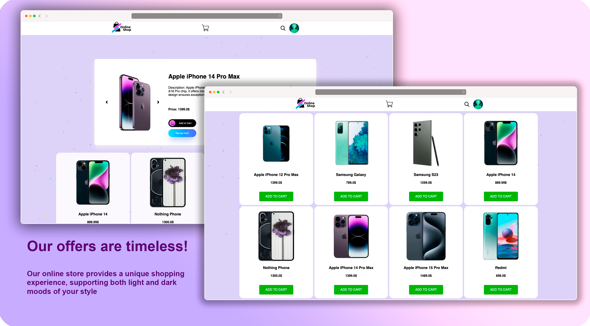

# E_Shop &middot; [](http://makeapullrequest.com)

[](#)
<!-- ABOUT -->
> E_Shop is an innovative online store with two color themes (light/dark) for user convenience.
> Administrators have the ability to create products and manage them effectively.
> Users can easily add products to the cart, select the required quantity, and also use the implemented payment system
> for
> convenience during shopping.
> The simple and intuitive interface ensures ease of use for all users.
<!-- END ABOUT -->

<hr>

<h1>📍How to install: </h1>

<!-- POSTMAN -->
<details><summary><h2>📮Connect to Postman:</h2></summary><br/>

<h3><b>1.1</b> Import <i>"Postman Collections"</i> folder into Postman</h3>
<h3><b>1.2</b> Set the environment settings <i>"User Data e_shop.postman_environment"</i></h3>
<h3><b>1.3</b> The <i>"E_Shop_API.postman_collection"</i> collection contains requests</h3>
<h3 name="1-4"><b>1.4</b> Go to the Google Configuration, select <i>"Change Sites"</i> and set host</h3>

```
http://localhost:8000
```

<h3 name="1-5"><b>1.5</b> Select <i>"Social application"</i></h3>
<p>
To integrate the <i>"Social application"</i> with your project, follow these steps:
</p>
<ul>
    <li>Visit <a href="https://console.cloud.google.com/welcome" target="_blank">Google Cloud Console</a> and CREATE PROJECT</li>
    <li>Navigate to <a href="https://console.cloud.google.com/apis/credentials" target="_blank">APIs & Services > Credentials</a></li>
    <li>Click on <b>"Create Credentials"</b> and choose <b>"OAuth client ID"</b></li>
    <li>Specify the application type as <b>"Web application"</b></li>
    <li>Set the name of your client (e.g., "Social App Client")</li>
    <li>Under <b>"Authorized redirect URIs,"</b> add the appropriate redirect URI for your application</li>
    <li>Click <b>"Create"</b> to generate your OAuth client ID and client secret</li>
</ul>
<p>
Once created, copy and securely store the generated <b>Client ID</b> and <b>Client secret</b>.
</p>
<pre>
    Client ID: Your_Client_ID
    Client secret: Your_Client_Secret
</pre>
</details>
<!-- END POSTMAN -->

<!-- MANUAL -->
<details><summary><h2>🔧Manual Installation:</h2></summary><br>
<h3> 2.1 Connect venv:</h3> 

```
python3 -m venv venv
```

<h3>2.2 Activate it:</h3>
<i>For Windows</i>

``` 
.\venv\Scripts\activate
```

<i>For MacOS</i>

``` 
source venv/bin/activate 
```

<h3>2.3 Install libraries:</h3>

```
pip install -r requirements.txt
```

<h3>2.4 Create Your .env:</h3>

```
# Django configuration
SECRET_KEY=your_secret_key
DEBUG=1  # Set 1 or 0 
#
# PostgreSQL (docker/local)
DB_ENGINE=django.db.backends.postgresql_psycopg2
DB_NAME=your_db_name
DB_USER=your_db_user
DB_PASSWORD=your_db_password
DB_PORT=your_db_port
#
# pgadmin container
PGADMIN_DEFAULT_EMAIL=your_pgadmin_email
PGADMIN_DEFAULT_PASSWORD=your_pgadmin_password
#
# Stripe payment
STRIPE_PUBLIC_KEY=pk_key
STRIPE_SECRET_KEY=sk_key
#
# Settings Gmail SMTP
EMAIL_HOST_USER=your@gmail.com
EMAIL_HOST_PASSWORD=your_email_password
```

<h3>2.5 Create PostgreSQ DB: </h3>
<i>Server > Data Bases > Create DB and give name</i>

```
e_shop_db
```

<h3>2.6 Apply migrations:</h3>

```
python manage.py migrate
```

<h3>2.7 Install fixtures:</h3>

```
python commands.py
```

<h3>2.8 Run Commands:</h3>

<i>Runserver:</i>

```
python manage.py runserver
```

<i>Celery worker:</i>

```
celery -A E_Shop_config worker --loglevel=info
```

<i>Celery beat:</i>

```
celery -A E_Shop_config beat --loglevel=info
```

<h3>2.9 Use the following steps for configuration:</h3>
<i>Go to Postman installation</i>
<br>
[• <b>1.4</b> Configure "Change Sites"](#1-4)
<br>
[• <b>1.5</b> Configure "Social application"](#1-5)

</details>
<!-- END MANUAL -->

<!-- DOCKER -->
<details><summary><h2>🐳Connect to Docker Compose:</h2></summary><br/>

<h3>3.1 Create Your .env and set correct values:</h3>

```
# Django configuration
SECRET_KEY=your_secret_key
DEBUG=1  # Set 1 or 0 
#
# PostgreSQL (docker/local)
DB_ENGINE=django.db.backends.postgresql_psycopg2
DB_NAME=your_db_name
DB_USER=your_db_user
DB_PASSWORD=your_db_password
DB_PORT=your_db_port
#
# pgadmin container
PGADMIN_DEFAULT_EMAIL=your_pgadmin_email
PGADMIN_DEFAULT_PASSWORD=your_pgadmin_password
#
# Stripe payment
STRIPE_PUBLIC_KEY=pk_key
STRIPE_SECRET_KEY=sk_key
#
# Settings Gmail SMTP
EMAIL_HOST_USER=your@gmail.com
EMAIL_HOST_PASSWORD=your_email_password
```

<h3>3.2 UP Docker-compose:</h3>

```
docker-compose up
```

<h3>3.3 Login to the container console:</h3>

```
docker exec -it django-container bash
```

<h3>3.4 Apply migrations:</h3>

```
python manage.py migrate
```

<h3>3.5 Install fixtures:</h3>

```
python commands.py
```

<h3>3.6 Use the following steps for configuration:</h4>
<i>Go to Postman installation</i>
<br>
[• <b>1.4</b> Configure "Change Sites"](#1-4)
<br>
[• <b>1.5</b> Configure "Social application"](#1-5)
<br>
<h3>3.7 Localhost Database Setup:</h3>
<i>Create a database on localhost:5050</i>

- Open localhost:5050 in your browser.
- Register the server.
- In the connection settings:
    - Host: postgres-container
    - Username: postgres
    - Password: your_password
    -

</details>
<!-- END DOCKER -->

<hr>
<h1>📂Detail information about project</h1>
<h3><a href="#">Try the link to the website</a> - (coming soon)</h3>

<!-- ADDITIONAL INFORMATION -->
<details><summary><h1>📚Additional Information</h1></summary><br/>

<h3>Connect to Stripe</h3>
<p>1. Go to the Stripe registration page and create your profile:</p>
<a href="https://dashboard.stripe.com/login"><b>Sign up for Stripe</b></a>

<p>2. Confirm your account.</p>

<p>3. Navigate to the following link to obtain your API keys and <b>copy</b> them:</p>
<a href="https://dashboard.stripe.com/test/apikeys"><b>Stripe API Keys</b></a>

<p>4. Past to your .env:</p>
<pre>
STRIPE_PUBLIC_KEY=Publishable key
STRIPE_SECRET_KEY=Secret key
</pre>

<h4>Test Cards:</h4>
<ul>
    <li>Visa: 4242 4242 4242 4242</li>
    <li>Mastercard: 5105 1051 0510 5100</li>
    <li>American Express: 3782 822463 10005</li>
    <li>Discover: 6011 1111 1111 1117</li>
</ul>

<h3>Connect to Google SMTP</h3>
<p>1. Create app password at the following link:</p>
<a href="https://myaccount.google.com/apppasswords">Google App Passwords</a>

<p>2. Set the following in your settings:</p>
<pre>
EMAIL_HOST_USER=example@gmail.com
EMAIL_HOST_PASSWORD=example_code
</pre>

<h3>User Credentials:</h4>
<h4 style="text-align: center;">Admin:</h4>

```
admin@gmail.com
```

```
Testpass1
```

<h4 style="text-align: center;">Basic User:</h4>

```
user@gmail.com
```

```
Testpass1
```

</details>
<!-- END ADDITIONAL INFORMATION -->

<!-- SCREENSHOTS -->
<details>
  <summary><h1>📸Screenshots</h1></summary>
  <br/>
  <p>Explore the visual journey of our E-Shop with these captivating screenshots:</p>
  <div style="text-align: center;">
    
    <br/>
    <p><i>Experience the allure of our Dark Mode.</i></p>
    
    <br/>
    <p><i>Embrace the elegance of our Light Mode.</i></p>
  </div>
</details>
<!-- END SCREENSHOTS -->


<!-- TIPS -->
<details>
  <summary><h1>🤓Tips</h1></summary>

<!-- LOCAL TUNNEL -->
<h3>Expose Localhost to the Internet using Serveo:</h3>

```
ssh -R 80:localhost:8000 serveo.net
```

```
ssh -o ServerAliveInterval=60 -R QvaShquai.serveo.net:80:localhost:8000 serveo.net
```

<!-- END LOCAL TUNNEL -->


<!-- TEST DATA -->
<h3>Dump data from Django apps to JSON files:</h4>

```
python manage.py dumpdata E_Shop_Products --indent 4 > mydemodata.json
python manage.py dumpdata E_Shop_Users --indent 4 > my_users_data.json
```

<h3>Load data back into Django apps:</h4>

```
python3 manage.py loaddata My_fixtures/my_products_data.json
python3 manage.py loaddata My_fixtures/my_users_data.json
```

<!-- END TEST DATA -->


<!-- CELERY -->
<h3>Run Celery worker:</h4>

```
celery -A E_Shop_config worker --loglevel=info
```

<h3>Run Celery beat:</h4>

```
celery -A E_Shop_config beat --loglevel=info
```

<h3>Start Redis server:</h4>

```
redis-server
```

<!-- END CELERY -->


<!-- GIT COMMANDS -->
<h3>year-month-day</h3>

```
git commit --date="2023-05-05T12:00:00" -m "Updated"
```

<h3>Undo the last commit while keeping changes</h3>

```
git reset --soft HEAD~1
```

<!-- END GIT COMMANDS -->


<!-- PostgreSQL -->
<h3>Resolve PostgreSQL port already in use</h3>

```
solve commands postgres already in use
sudo lsof -i :5432
sudo kill -9 <your_port>  
sudo rm /tmp/.s.PGSQL.5432.lock
sudo rm /tmp/.s.PGSQL.5432             
chmod 1777 /tmp
```

<!-- END PostgreSQL -->


<!-- TEST COMMANDS -->
<h3>Run Django Tests:</h3>

```
python manage.py test
```

<h3>Run Tests with Coverage:</h3>

```
coverage run --source='.' manage.py test
```

<h3>Generate Coverage HTML Report:</h3>

```
coverage html
```

<!-- END TEST COMMANDS -->


</details>
<!-- END TIPS -->